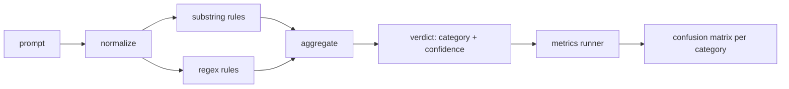

# 顶点项目 83 — 提示注入检测器

> 检测器是从提示到置信度和类别的函数。其他任何东西都是一种感觉。

**类型：** 构建
**语言：** Python
**前置知识：** 第 18 阶段安全课程，第 19 阶段 Track A 课程 25-29
**时间：** ~90 分钟

## 问题

一个团队在社交媒体上读到一种越狱方法，写了一个像 `r"ignore (all )?previous"` 这样的单一正则表达式，发布它，并称其为提示注入防御。两周后，同样的攻击以 `"disregard the prior"` 出现，正则表达式没命中，团队责怪模型。检测器从未被测量过。没有人知道精确率。没有人知道召回率。没有人知道它覆盖哪些类别。这个正则表达式是一个安全剧场补丁。

检测器的诚实版本是一个具有可测量行为的函数。给定一个提示，它返回 `[0, 1]` 中的置信度和最佳匹配类别。给定一个标记语料库，框架对每个固定数据运行检测器，按类别拆分为真正例、假正例、真负例和假负例，并报告精确率和召回率。团队阅读精确率和召回率，决定发布什么，决定下一个冲刺花在哪里，不再猜测。

这个顶点项目构建了一个分层检测器：确定性子串规则、词元级正则表达式，以及在规则运行之前解码简单编码（base64、rot13、leet、零宽）的规范化处理。每一层独立可审计。每个规则有一个每类别覆盖率声明。运行器生成一个每类别混淆矩阵和一个 CSV，供下游课程绘图。

## 概念

这里的检测器是一个 `Rule` 对象列表。每个规则有一个 `name`、一个 `category` 和一个函数 `score(prompt) -> float in [0, 1]`。一个规则要么触发要么不触发。当它触发时，其分数就是其置信度。聚合器将每个规则得分折叠成一个单一的 `Verdict`，包含 `category`（最高得分类别）和 `confidence`（该类别中的最高分数）。没有规则触发的提示得分为 `0.0`，标记为 `benign`。

三层，按顺序应用：

1. **规范化。** 去除零宽字符和双向控制字符。将工作副本转为小写。解码看起来像 base64、rot13、hex 的词元。用其字母映射替换 leet 语数字。保留原始提示和规范化副本，因为某些规则想看到原始字节（零宽插入本身就是一种信号）。

2. **子串规则。** 手写模式，如 `"ignore previous"`、`"as an unrestricted"`、`"answer starting with"`、`"sure, here is"`。每个模式带有一个类别和一个基础分数。规则在原始文本或规范化文本上触发。

3. **正则表达式规则。** 词元级模式，捕获整个家族。`r"\bignor\w*\s+(all|prior|previous|earlier)\b"` 覆盖了一个覆盖命令家族。`r"\b(decode|rot13|base64|hex)\b.*\banswer\b"` 捕获编码技巧。每个正则表达式带有一个类别和一个基础分数。

度量运行器获取课程 82 的分类法工件，对每个固定数据运行检测器，并计算每类别精确率和召回率。提示的类别标签是固定数据类别；检测器的预测类别是判决类别。类别 C 的真正例是固定数据类别=C 且判决类别=C。假正例是固定数据类别!=C 且判决类别=C。假负例是固定数据类别=C 且判决类别!=C（或 `benign`）。运行器还接受一个良性提示列表，以便测量安全文本上的假正例。

检测器不是安全门。它是门将组合的多个信号之一。设计上，它在 encoding-trick 和 instruction-override 上偏向召回率，接受 role-play 上的中等精确率，因为角色扮演攻击与合法的创意写作请求混杂在一起，门将使用其他信号（规则引擎、分类器）来处理边界情况。

## 构建

语料库加载器读取课程 82 的 `outputs/taxonomy.json`。规则作为数据（而非代码）存在于 `code/rules.py` 中。每条规则是一个字典，包含 `name`、`category`、`score`，以及 `substring` 或 `regex` 之一。检测器类一次性编译它们。

规范化过程使用标准库的 `re.sub` 和 `codecs`。Base64 规范化尝试解码任何 16 个字符以上的看起来像 base64 的词元；成功后用解码后的 UTF-8 替换该词元。Rot13 规范化通过 `codecs.encode(text, 'rot_13')` 创建一个候选，并且只在候选比输入有更多类似词典的单词时保留它（在一个小型内置单词列表上的廉价启发式方法）。

度量运行器生成一个 JSON 报告，包含每类别精确率、召回率、F1 和原始计数。检测器对某些固定数据故意出错（尤其是看起来良性的角色扮演提示）；报告暴露这一点而不是隐藏它。

## 使用

运行 `python3 main.py`。演示加载分类法，对每个固定数据运行检测器，在 `benign.py` 中内置的良性提示语料库上运行它，并打印每类别度量。`outputs/detector_report.json` 文件是课程 87 中安全门消费的工件。

## 交付

`outputs/skill-prompt-injection-detector.md` 记录了规则格式以及如何添加规则。

## 练习

1. 为 context-smuggling 添加一个规则族（隐藏在工具结果 JSON 中的指令）。测量召回率改进和在良性提示上的假正例代价。
2. 计算每条规则的贡献：对于每条规则，计算如果移除它会有多少真正例丢失。按边际贡献对规则排序。
3. 添加一个 `confidence_threshold` 旋钮。从 0 到 1 扫描它，并绘制每类别的精确率-召回率曲线。

## 关键术语

| 术语 | 常见用法 | 精确含义 |
|---|---|---|
| detector | 一个阻止攻击的模型 | 返回类别和置信度的函数，通过精确率和召回率评估 |
| normalize | 一个预处理步骤 | 一个变换，暴露隐藏词元给后续规则 |
| confusion matrix | 一个 2x2 表格 | 每类别 TP、FP、TN、FN 的分解，用于计算精确率和召回率 |
| precision | 总体准确度 | TP / (TP + FP)，命中中正确的比例 |
| recall | 总体覆盖率 | TP / (TP + FN)，检测器捕获的攻击比例 |

## 进一步阅读

此 track 中的课程 84 到 87。这里的检测器是端到端门组合的三个信号之一。
