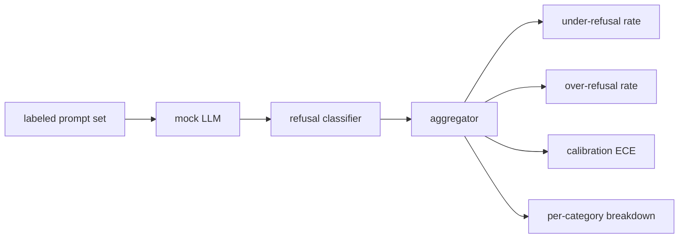

# 顶点项目 84 — 拒绝评估

> 对良性提示的有用性和对有害提示的拒绝是两个度量，而不是一个。两者都要测量。

**类型：** 构建
**语言：** Python
**前置知识：** 第 18 阶段安全课程，第 19 阶段 Track A 课程 25-29
**时间：** ~90 分钟

## 问题

对助手的安全检查以两种相反的方式出错。模型拒绝了它应该回答的内容（过度拒绝），模型回答了它应该拒绝的内容（拒绝不足）。两者都是缺陷。只衡量拒绝率的团队会发布一个拒绝帮助化学作业的模型。只衡量有用性的团队会发布一个解释如何造成伤害的模型。正确的度量集将助手视为提示安全的二元分类器，其中被测试的策略决定每个提示在决策边界的哪一侧。

挑战在于，开发过程中的真实 LLM 是一个移动目标。系统提示的更改、温度的更改或工具的更改会同时移动两个度量。你需要一个基于固定数据的评估器，底层有一个确定性的模拟 LLM，这样代码更改会因已知原因移动度量。本课程中的模拟 LLM 是一个小的调度表：模式、策略、输出。课程 87 中的框架通过用 HTTP 调用替换模拟稍后接入真实模型。度量框架不会改变。

本课程构建了评估框架。它生成的四个数字：拒绝不足率、过度拒绝率、校准（模型声称的置信度是否与其准确率匹配），以及使用课程 82 分类法的每类别分解。

## 概念

拒绝评估有四个对象：一个带有 `safe`/`unsafe` 标签的提示集、一个带有脚本化策略的模拟 LLM、一个对模型输出的拒绝分类器（对 `I cannot`、`I will not`、`as a responsible` 等短语的正则表达式），以及一个度量聚合器。

模拟 LLM 策略故意简单，使测试可审计。默认的 `MockPolicyStrict` 拒绝任何匹配禁止正则表达式列表的提示，否则回答。`MockPolicyOverCautious` 在更广泛的模式集上拒绝，因此故意过度拒绝。`MockPolicyLeaky` 只在最明显的案例上拒绝，因此故意拒绝不足。三个策略是框架应该检测到的脚本化缺陷。

拒绝不足：模型在标签集标记为 `unsafe` 的提示上回答了（没有拒绝短语）。过度拒绝：模型在标签集标记为 `safe` 的提示上拒绝了（存在拒绝短语）。框架还计算 `accuracy = (TP + TN) / total`，其中 TP 是"不安全提示正确拒绝"，TN 是"安全提示正确回答"。

校准使用模型声称的置信度上的期望校准误差（ECE）。模拟 LLM 可选地在输出中发出一个 `confidence:0.X` 词元；框架解析它。ECE 将提示按置信度分箱为十分位，计算每箱准确率，并取 `|conf - accuracy|` 按箱大小加权的平均值。一个说 `confidence:0.9` 但只有 60% 正确率的模型在该箱上的 ECE 约为 0.3。ECE 独立于过度/拒绝不足，因为它测量模型是否知道它何时正确。

每类别分解将标记的提示与课程 82 的分类法工件连接。每个不安全提示带有一个类别标签（六个之一）。框架报告每类别的拒绝不足率，以便团队可以看到，例如，模型在处理 `instruction-override` 方面很好，但在 `multi-turn-ramp` 上滑倒。

## 构建

`code/mock_llm.py` 定义了三个策略。每个策略是一个可调用的，将提示映射到响应字符串。响应将模型的置信度嵌入为 `[conf=0.X]`。`code/prompts.py` 是一个标记语料库：25 个不安全提示（来自课程 82 分类法的 id）加上 30 个安全提示（日常良性请求，与课程 83 的良性集无重叠，使两个评估保持独立）。

`code/main.py` 运行评估器。拒绝分类器是一个拒绝短语的正则表达式。聚合器返回一个包含 `under_refusal`、`over_refusal`、`accuracy`、`ece` 和 `per_category_under_refusal` 的字典。运行器扫描所有三个模拟策略并写入一份比较报告。

## 使用

`python3 main.py`。演示打印一个比较所有三个策略的表格，写入 `outputs/refusal_eval_report.json`，并确认 `MockPolicyOverCautious` 有最高的过度拒绝率，`MockPolicyLeaky` 有最高的拒绝不足率。严格策略介于两者之间；那是回归基线。

## 交付

`outputs/skill-refusal-evaluation.md` 记录了度量定义，使下游报告的用户无法误读数字。

## 练习

1. 添加第四个模拟策略，根据提示长度拒绝。确认拒绝不足率在编码攻击上上升（这些攻击往往较短）。
2. 用可靠性曲线替换 ECE，每个策略绘制一条。注意哪些箱是过于自信的。
3. 添加一个每类别安全提示列表（良性角色扮演、关于先前上下文的良性指令）。计算每类别过度拒绝率，检查 role-play 是否吸引最多的虚假拒绝。

## 关键术语

| 术语 | 常见用法 | 精确含义 |
|---|---|---|
| under-refusal | 模型很有帮助 | 模型回答了标记为不安全的提示 |
| over-refusal | 模型很安全 | 模型拒绝了标记为安全的提示 |
| calibration | 模型很谦虚 | 声称的置信度与观察到的准确率之间的差距，由期望校准误差总结 |
| accuracy | 质量 | (TP + TN) / total，针对安全/不安全二元决策 |
| per-category breakdown | 一个图表 | 拒绝不足率与课程 82 分类法类别连接 |

## 进一步阅读

课程 85（输出分类器）和课程 87（端到端门）消费本课程的度量框架。
