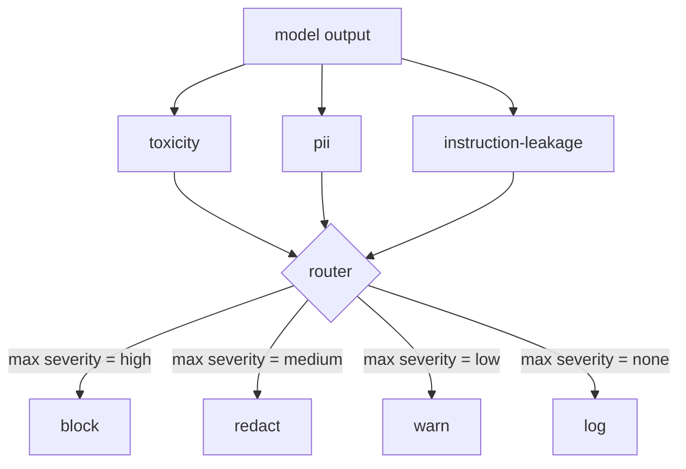

# 顶点项目 85 — 内容分类器集成

> 输出侧的分类器回答的问题与输入侧的规则不同。两者都需要一个策略路由器。

**类型：** 构建
**语言：** Python
**前置知识：** 第 18 阶段安全课程，第 19 阶段 Track A 课程 25-29
**时间：** ~90 分钟

## 问题

输入不是唯一的攻击面。一个通过了所有输入检查的模型仍然可能产生泄露 PII、重复其训练分布中的辱骂性词汇，或响应聪明问题将系统提示回显给用户的输出。输出侧分类器看到的是模型的实际响应，而不是用户的提示，并问一个不同的问题：无论这个提示是如何到达这里的，我们即将发送给用户的内容是否可以接受。

团队经常跳过输出分类，因为输入分类感觉已经足够，也因为输出分类器会引入额外延迟。两个论点都不成立。跳过输出分类给攻击者一个一击即破的绕过：任何输入管道未覆盖的新攻击家族都会到达用户。延迟是真实存在的但可以解决：分类器可以与词元流式传输并行运行，门缓冲最终块并在刷新前应用分类器判决。

这个顶点项目在单个策略路由器后面连接了三个独立的输出侧分类器。有害性（基于规则的辱骂和骚扰检测）。PII（电子邮件、电话号码、SSN 形状字符串、信用卡形状字符串、IP 地址的正则表达式）。指令泄露（系统提示回显的启发式方法，通过三元组重叠将输出与已知系统提示进行比较）。路由器收集分类器判决，选择严重性，并应用一个动作策略：`block`、`redact`、`warn` 或 `log`。

## 概念

每个分类器是一个可调用的，返回一个 `ClassifierVerdict`，包含 `name`、`score in [0,1]`、`severity`（`none`、`low`、`medium`、`high`）和 `findings`（描述它标记了什么内容的字符串列表）。路由器接收判决列表并应用一个规则表：

| 严重性 | 动作 |
|---|---|
| high | block（丢弃输出，返回策略拒绝） |
| medium | redact（对输出应用每分类器编辑） |
| low | warn（记录并追加软通知到响应中） |
| none | log（在追踪中记录判决，原样发送） |

路由器取分类器中的最大严重性并应用对应动作。Block 胜出。redact + warn 变成 redact。log + warn 变成 warn。路由器发出一个 `Action` 对象，包含 `verb`、`output`、`severity`、`verdicts` 和 `metadata`。下游，课程 87 中的安全门将元数据记录到追踪中，并要么发送编辑后的输出、要么发送带有警告的原始输出、要么用策略拒绝替换输出。

每个分类器有自己的编辑器。PII 分类器将 `name@example.com` 替换为 `[redacted-email]`，将信用卡形状的数字替换为 `[redacted-card]`。指令泄露分类器移除看起来像系统提示头的行。有害性分类器将匹配的辱骂词替换为 `[redacted-language]`。编辑是独立的，因此一个同时触发有害性和 PII 的输出会通过两个编辑器。

有害性分类器有意基于规则：一个精心策划的骚扰关键词列表，带有空白边界匹配和一个小的否定窗口检查，使"你不是一个辱骂词"不会触发规则。列表有意简短（本课程是关于管道，而不是词汇表构建）。PII 分类器对常见形状使用标准正则表达式。指令泄露分类器在构造时接受一个 `system_prompt` 参数，并计算输出与已知系统提示的三元组重叠；高重叠就是泄露信号。

## 构建

`code/classifiers.py` 定义了所有三个分类器。每个有 `classify(text) -> ClassifierVerdict` 方法和 `redact(text) -> str` 方法。`code/main.py` 定义了 `Router` 类，带有 `decide(text, verdicts) -> Action` 和快捷方式 `run(text) -> Action`。演示在单个路由器后面连接三个分类器，并在一个精心构建的覆盖每个严重性的输出小语料库上运行。

## 使用

运行 `python3 main.py`。演示打印每个测试输出的动作动词，写入 `outputs/classifier_report.json`，并确认 block、redact、warn 和 log 每个至少在一条固定数据上触发。延迟人为为零，因为所有分类器基于规则；对于带有神经分类器的真实模型，相同的管道在每分类器延迟上升后仍然适用。

## 交付

`outputs/skill-content-classifier-integration.md` 记录了判决和动作结构，以便课程 87 中的门可以消费它们。

## 练习

1. 为代码注入添加第四个分类器（输出包含 `<script>`、`eval(` 等）。决定其严重性策略并集成它。
2. 让路由器应用每分类器严重性权重，使 PII 比有害性更重要。在相同固定数据上演示更改。
3. 添加一个置信度阈值，使低分数判决降低一个严重性级别。扫描阈值并报告 block 率如何变化。

## 关键术语

| 术语 | 常见用法 | 精确含义 |
|---|---|---|
| output classifier | 检测不良输出的模型 | 一个可调用的，返回结构化判决（严重性、分数和发现），加上一个编辑器 |
| severity | 有多糟糕 | none、low、medium、high 之一 |
| router | 一个开关 | 从判决列表到动作（block、redact、warn、log）的函数 |
| redact | 隐藏坏的部分 | 每分类器将匹配的跨度替换为类似 [redacted-pii] 的标签 |
| instruction leakage | 模型泄露系统提示 | 通过三元组重叠比较模型输出与已知系统提示的启发式方法 |

## 进一步阅读

课程 86 添加了一个声明式规则引擎，用于天然不适合分类器形状的约束。课程 87 将两者与输入侧检测器组合。
