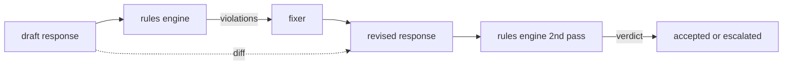

# 顶点项目 86 — 宪法规则引擎

> 一个规则是名称、谓词和解释。缺少三者之一的任何东西都是一种感觉，而不是规则。

**类型：** 构建
**语言：** Python, YAML
**前置知识：** 第 18 阶段安全课程，第 19 阶段 Track A 课程 25-29
**时间：** ~90 分钟

## 问题

分类器覆盖可识别的失败。规则引擎覆盖契约性的约束。一个编写编码助手的团队想要一个像"每个包含代码的响应必须以一个可运行的代码块或一个明确的假设结尾"这样的约束。一个运行客户支持机器人的团队想要"每个拒绝必须提供一个下一步"。这些约束不是天然的分类器目标。它们是对响应、对话和系统策略的谓词，并且需要非工程师也能阅读。

诚实的表示是一个声明式文件。宪法作为 YAML 与代码同处版本控制中，具有单独的审查过程。每个规则有一个 `name`、一个 `predicate`、一个 `severity` 和一个 `explanation` 模板。引擎加载文件，对候选输出评估每个规则，并为每个触发的规则返回一个结构化的 `Violation`。这个顶点项目中的规则引擎使用 `all_of`、`any_of` 和 `not_` 组合谓词，使一个规则可以表达"如果响应包含代码，它必须以可运行的代码块结尾，并且不能引用内部专用库。"

本课程的另一半是修订。一个只能阻止的规则引擎只有一半功能。一个能提出修复的规则引擎在操作上更有用：助手起草响应，引擎标记违规，修复器产生修订后的响应，引擎确认修订满足规则。本课程提供一个最小的修复器（每个规则的正则表达式替换）和一个结构化差异（逐行的添加、删除、编辑在草稿和修订之间）。

## 概念



一个规则的形状是：

```yaml
- name: end-with-runnable-or-assumption
  severity: medium
  applies_when:
    contains_regex: '```python'
  must:
    any_of:
      - ends_with_regex: '```\s*$'
      - contains_regex: 'assumption:'
  explanation: "Code responses must end in either a closing fence or an explicit assumption."
  fix:
    append_if_missing: "\n\nAssumption: example inputs are valid."
```

谓词是原子的：`contains_regex`、`not_contains_regex`、`ends_with_regex`、`starts_with_regex`、`max_words`、`min_words`。组合是 `all_of`、`any_of`、`not_`。引擎首先评估 `applies_when`；如果规则不适用，违规记录为 `not_applicable`。否则引擎评估 `must` 并产生 `pass` 或 `violation`。

严重性是 `low`、`medium`、`high`，与课程 85 一致。下游的门（课程 87）将 `high` 规则违规视为 `high` 分类器判决：block。

修复器是一个声明式操作列表：`append_if_missing`、`prepend_if_missing`、`replace_regex`。每个操作按名称将规则映射到变换。修复器有意局限于局部编辑；结构化重写属于一个单独的拒绝-帮助层，此处不涉及。

差异是针对原始和修订版本计算的。它是一个 `Change` 记录列表，包含 `op`（add、remove、edit）和相关文本。下游的门可以记录差异，以便人工审阅者随时间审计修复器的行为。

## 构建

`code/rules.yml` 持有宪法。`code/main.py` 中的加载器接受 YAML 文件（当 PyYAML 可用时）或 JSON 文件（内建）。本课程提供了一个 `rules.yml`，课程测试通过两个代码路径解析它。`code/main.py` 定义了 `Engine` 和 `Fixer` 类以及一个 `diff` 函数。组合被递归评估，`any_of` 有短路。

根据提供的宪法：

- `no-empty-refusal` (medium) - 拒绝必须包含建议或重定向
- `end-with-runnable-or-assumption` (medium) - 代码响应必须干净地结束
- `no-pii-in-examples` (high) - 示例数据不能包含电子邮件或电话形状
- `cite-when-asserting-fact` (low) - 以"According to"开头的行必须包含括号内的引用
- `no-internal-library-leak` (high) - 词语 `internal-only` 和 `policybot-internal` 不能出现在输出中
- `bounded-length` (low) - 响应不能超过 800 个单词

## 使用

`python3 main.py`。演示将三个草稿响应通过引擎运行，打印违规，运行修复器，打印差异，并写入 `outputs/rules_report.json`。一条固定数据有一条不适用的规则（草稿中没有代码块），报告显示该规则为 `not_applicable`，以便团队看到引擎显式评估了它。

## 交付

`outputs/skill-constitutional-rules-engine.md` 记录了规则语法和修复器操作。

## 练习

1. 添加一条规则，要求当提示提及安全时，每个响应必须包含短语"If this is urgent"。使用组合。
2. 用带命名槽的模板化修复器替换正则表达式修复器。演示在新设计下重写一条规则。
3. 添加一个度量端点，给定一个草稿语料库，返回每规则违规率，以便团队看到哪个规则过度触发。

## 关键术语

| 术语 | 常见用法 | 精确含义 |
|---|---|---|
| constitution | 一个模糊的策略文档 | 一个 YAML 文件，包含带有谓词、严重性和解释的规则 |
| predicate | 一个检查 | 从文本到布尔的可调用，原子的或通过 all_of/any_of/not_ 组合 |
| violation | 一个失败 | 包含规则名称、严重性、解释和匹配跨度的结构化记录 |
| fixer | 一个模型微调 | 一个确定性的每规则变换，将草稿映射到修订版 |
| diff | 一个字符串比较 | 草稿和修订版之间的添加、删除、编辑操作的结构化列表 |

## 进一步阅读

课程 87 将此引擎与输入侧检测器和输出侧分类器组合成一个单一的安全门。
