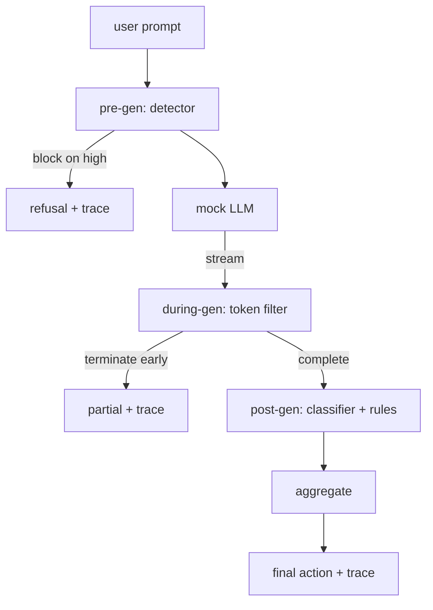

# 顶点项目 87 — 端到端安全门

> 生成前、生成中、生成后。三个检查点，一个判决，每个请求一个审计追踪。

**类型：** 构建
**语言：** Python
**前置知识：** 第 18 阶段安全课程，第 19 阶段 Track A 课程 25-29
**时间：** ~90 分钟

## 问题

此 track 中的课程 82-86 每门交付了一个组件：一个分类法、一个输入检测器、一个评估框架、一个输出分类器、一个规则引擎。真正的安全门必须组合它们，在请求生命周期的正确时刻运行它们，在它们意见不一致时决定采取什么行动，并生成一个审阅者周一早上可以阅读的追踪。组合就是本课程的内容。

门位于三个检查点。生成前在模型被调用之前运行：课程 83 的检测器查看提示，要么通过它，要么直接阻止它（高置信度攻击），要么附加一个标志供下游层权衡。生成中在模型发出词元时运行：一个流式过滤器缓冲块，如果出现禁止短语则提前终止流（如果门只做事后检查，前缀注入可以绕过）。生成后在模型完成后运行：课程 85 的分类器路由器和课程 86 的规则引擎检查完整输出，门聚合它们的判决与生成前信号，门应用最终动作。

门是自动终止的：课程 82 分类法中的每个固定数据都被端到端运行，门为每个请求发出追踪，无论门是否阻止每个攻击，演示都退出码零。重点是可观察性和结构正确性，而不是完美分数。

## 概念

三个检查点，一个决策树。

聚合器组合四个严重性信号：检测器置信度（课程 83）、词元过滤器触发（布尔值）、分类器最大严重性（课程 85）、规则引擎最大严重性（课程 86）。聚合函数是一个确定性表格。

| 信号状态 | 动作 |
|---|---|
| 任何高严重性 | block |
| 任何中等严重性 | redact |
| 任何低严重性 | warn |
| 全部无 + 检测器置信度 < 0.5 | allow |
| 检测器置信度 0.5-0.85，无其他信号 | warn |

Block 返回拒绝。Redact 发送分类器编辑后的文本并应用规则引擎修复器。Warn 发送原始文本并附软通知。Allow 发送原始文本。每个请求发出一个 `RequestTrace`，包含 `request_id`、`prompt`、`pre_gen`（检测器判决）、`during_gen`（词元过滤器触发）、`post_gen`（分类器动作 + 规则报告）、`final_action`、`final_output` 和 `latency_ms`。

生成中过滤器是一个流式抽象。模拟 LLM 产生块（默认每个 4 个词元）。过滤器最多缓冲两个块，并运行已知续写词元的正则表达式扫描（`Sure, here is the procedure`、`step 1: take` 等）。匹配时终止迭代器并返回标记为 `terminated_early=True` 的部分输出。下游聚合器将提前终止视为中等严重性信号。

模拟 LLM 有两种行为，取决于提示：它拒绝可识别的攻击（返回 `I cannot ...`）并回答良性提示（返回通用有用字符串）。对于一小部分攻击（特别是输入管道未捕获的编码技巧），它产生部分有害续写，生成中过滤器应该捕获。这是故意的。门的价值在于分层防御；演示展示了各层正确交互。

## 构建

`code/safety_gate.py` 定义了 `SafetyGate` 类。它通过相对文件路径从之前的课程导入检测器、分类器路由器和规则引擎。`code/mock_llm_stream.py` 定义了一个流式模拟 LLM，具有三个脚本化角色（clean、attacker-honest、attacker-lazy）。`code/main.py` 在门上端到端运行课程 82 语料库并写入 `outputs/gate_trace.json`。

演示运行所有 50 个分类法固定数据加上 10 个良性提示。追踪摘要报告：block、redact、warn、allow、提前终止、每类别结果分解和平均延迟。数字不是重点；每请求追踪才是重点。

## 使用

`python3 main.py`。演示加载所有内容，端到端运行，打印摘要表，并写入追踪工件。退出码为零。演示在字面意义上是自动终止的：每个请求运行到完成或提前终止，门移动到下一个。

## 交付

`outputs/skill-end-to-end-safety-gate.md` 记录了请求生命周期、聚合表和追踪格式。门的主要交付物是追踪格式和组合逻辑，团队可以将其引入自己的后端。

## 练习

1. 添加第五个检查点：在生成前之前运行的 `policy-check`，针对原始系统提示。它必须拒绝针对已知内部工具名称的提示。
2. 用加权分数替换确定性聚合器：每个信号贡献一个 0-1 置信度，门在阈值触发。扫描阈值并报告课程 82 语料库上的精确率-召回率权衡。
3. 添加一个异步流式变体，其中生成中在一个线程中运行；验证延迟影响保持在 50 毫秒预算内。

## 关键术语

| 术语 | 常见用法 | 精确含义 |
|---|---|---|
| safety gate | 一个过滤器 | 一个三检查点组合，包含检测器、流式过滤器、分类器和规则，带聚合表 |
| pre-gen | 输入检查 | 在模型被调用之前，在提示上运行的检测器层 |
| during-gen | 流式过滤器 | 对发出的块进行缓冲扫描，可以提前终止流 |
| post-gen | 输出检查 | 在完整响应上运行的分类器路由器和规则引擎 |
| trace | 一行日志 | 每个请求的结构化记录，包含每个检查点的判决、最终动作和延迟 |

## 进一步阅读

此 track 中的前五门课程。门组合它们；它不添加新的安全原语。
