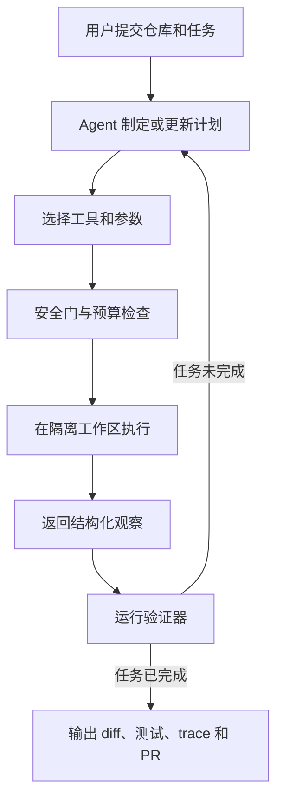
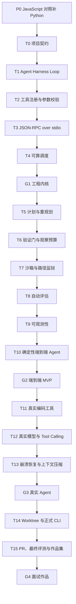

# Terminal Coding Agent 项目式学习路线

> 用一个能在终端中搜索、修改、测试并交付代码的 Agent，系统学习 Agent Loop、工具协议、可靠性、安全、评估、可观测性和生产化交付。

**学习方式：** JavaScript 对照补 Python，先手写工程机制，再接真实模型和框架  
**主线范围：** `P0.1–P0.8`、`T0–T15`  
**预计时间：** Python 预备 4–6 小时，主干约 33.5 小时  
**最终产物：** 一个可运行、可测试、可恢复、可评估、可创建 PR 的 Terminal Coding Agent  
**当前进度：** P0 已完成；T0.1–T0.3 已完成，下一节为 T0.4 `__post_init__`

## 目录

- [最终要做成什么](#最终要做成什么)
- [完整学习路线](#完整学习路线)
- [阶段总览](#阶段总览)
- [P0：JavaScript 对照补 Python](#p0javascript-对照补-python)
- [T0：项目契约与最小骨架](#t0项目契约与最小骨架)
- [T1–T4：Agent 工程内核](#t1t4agent-工程内核)
- [T5–T7：控制与安全](#t5t7控制与安全)
- [T8–T10：质量闭环与端到端 MVP](#t8t10质量闭环与端到端-mvp)
- [T11–T13：真实编码 Agent](#t11t13真实编码-agent)
- [T14–T15：生产化交付与作品集](#t14t15生产化交付与作品集)
- [阶段验收点](#阶段验收点)
- [最终毕业标准](#最终毕业标准)
- [学习进度](#学习进度)

## 最终要做成什么

输入一个本地 Git 仓库和自然语言任务，Agent 最终能够：

1. 理解任务并生成可执行计划。
2. 搜索、读取和修改代码。
3. 运行测试并分析失败信息。
4. 根据观察结果继续、重试、重新规划或停止。
5. 限制工具参数、目录范围、执行时间和输出大小。
6. 在独立 Git worktree 中工作，不污染用户当前分支。
7. 在进程中断后恢复计划和执行状态。
8. 记录工具调用、模型消耗、失败原因和完整追踪。
9. 用固定任务集衡量通过率、延迟和成本。
10. 输出代码差异、测试证据和追踪包，并可选创建 PR。



## 完整学习路线



## 阶段总览

| 阶段 | 学习内容 | 阶段结果 | 预计时间 |
|---|---|---|---:|
| P0 | 用 JavaScript 对照补齐项目需要的 Python | 能阅读、修改并测试 T0 代码 | 4–6 小时 |
| T0 | 定义 Agent 接收什么、返回什么、怎样表示错误 | 稳定的输入、输出和错误契约 | 1 小时 |
| T1–T4 | Agent Loop、工具注册、协议、可靠调度 | 不依赖真实模型的工程内核 | 6 小时 |
| T5–T7 | 计划与重规划、验证门、沙箱 | 可限制、可重规划、可安全执行 | 4.5 小时 |
| T8–T10 | 自动评估、可观测性、端到端 Agent | 可评估的确定性 Coding Agent MVP | 4.5 小时 |
| T11–T13 | 真实编码工具、真实模型、崩溃恢复 | 能处理真实仓库的 Agent | 9 小时 |
| T14–T15 | Worktree、CLI、PR、最终评测 | 可演示、可交付的面试作品 | 8.5 小时 |

## P0：JavaScript 对照补 Python

P0 不单独学习一整套 Python，只补 Terminal Coding Agent 当前需要的语法。每节都使用同一个结构：JavaScript 等价代码、Python 实现、差异说明、运行结果和小练习。

| 小节 | 学习内容 | 在 Agent 项目中的用途 | 完成标准 |
|---|---|---|---|
| P0.1 | 文件执行、变量、字符串、`print()` | 运行 CLI 和理解模块加载 | 能独立运行并修改 Python 文件 |
| P0.2 | 布尔值、比较、`if/else`、缩进 | 判断状态和输入是否合法 | 能写出正确的条件分支 |
| P0.3 | 函数、参数、`return`、f-string | 编写校验器和转换函数 | 能解释参数、局部变量和返回值 |
| P0.4 | 列表、字典、循环、结构化数据 | 处理任务、错误详情和 JSON | 能遍历并转换嵌套数据 |
| P0.5 | 类、对象、`self`、`dataclass` | 定义 `TaskRequest` 和 `TaskResult` | 能读懂并创建数据对象 |
| P0.6 | `Enum` 和受限状态值 | 定义任务状态和错误码 | 能说明为什么不用任意字符串 |
| P0.7 | 自定义异常、`raise`、`try/except`、导入 | 表达和捕获结构化错误 | 能区分抛出错误与返回失败结果 |
| P0.8 | `unittest`、断言、异常测试 | 验证契约和故障路径 | 能新增并运行一个单元测试 |

P0 的重点不是记住所有 Python 语法，而是能回答：这段代码接收什么、改变什么状态、返回什么、失败时发生什么。

## T0：项目契约与最小骨架

T0 先冻结边界，不接真实模型，不加入复杂工具循环。

| 小节 | 学习内容 | 产出 |
|---|---|---|
| T0.1 | 输入契约 `TaskRequest`、`dataclass(frozen=True)`、`Path` | 不可变的任务请求 |
| T0.2 | `TaskStatus`、`TaskResult`、`None`、`to_dict()` | 统一且可序列化的任务结果 |
| T0.3 | `ErrorCode`、`AgentError`、`retryable`、`details` | 结构化错误模型 |
| T0.4 | `__post_init__` 和结果不变量 | 阻止“成功但带错误”等矛盾状态 |
| T0.5 | `validate_request()` | 对任务编号、目标和仓库目录做校验 |
| T0.6 | `FakeCodingAgent.run()` | 连接输入校验与统一结果 |
| T0.7 | `argparse`、JSON 和退出码 | 可从终端运行的最小 CLI |
| T0.8 | 契约测试与完整数据流复盘 | 可重复运行的测试和面试表达 |

完成 T0 后应能解释：为什么要先稳定 Harness、工具和错误契约，再选择模型或框架。

## T1–T4：Agent 工程内核

这一阶段全部使用确定性 Fake/Policy。目标是先证明控制循环和工具系统正确，再引入模型的不确定性。

### T1 Agent Harness Loop

- **学什么：** `PLAN → ACT → OBSERVE → VERIFY → DONE/PAUSE` 状态机、轮次预算、时间预算和暂停语义。
- **做什么：** 可注入假策略的 Harness 和生命周期事件流。
- **怎样算完成：** 正常完成、预算暂停、策略错误三条路径都能确定性复现。
- **面试表达：** 模型提出下一步，Harness 决定这一步是否以及如何发生。

### T2 工具注册表与参数校验

- **学什么：** `工具名 → 参数模式 → 处理器` 注册表、JSON Schema 子集和精确错误路径。
- **做什么：** `ToolSpec`、Registry、Validator 和错误信封。
- **怎样算完成：** 未知工具、缺少字段、类型错误、额外字段和重复注册都有测试。
- **面试表达：** Schema 既是模型的说明书，也是运行时的安全边界。

### T3 JSON-RPC 2.0 over stdio

- **学什么：** 请求、响应、通知、关联 ID、批处理、标准错误和 stdin/stdout 传输边界。
- **做什么：** 自终止的 JSON-RPC Client/Server。
- **怎样算完成：** 损坏消息不阻塞后续请求；通知不返回响应；响应 ID 正确匹配。
- **面试表达：** 协议定义消息形状，注册表定义工具形状，两者属于不同层。

### T4 工具调用调度器

- **学什么：** 超时、错误归一化、有限重试、退避、幂等、并发上限和 DLQ 边界。
- **做什么：** Dispatcher、`ToolResult`、`RetryPolicy` 和 `IdempotencyStore`。
- **怎样算完成：** 临时错误会重试；永久错误不重试；慢调用会超时；相同幂等键不会重复执行。
- **面试表达：** DLQ 保存待处置失败，重试策略处理临时失败，两者不是同一个队列。

## T5–T7：控制与安全

### T5 Plan / Execute / Replan

- **学什么：** 类型化计划步骤、计划游标、执行反馈、计划差异和重规划预算。
- **做什么：** Planner、Executor、`PlanDiff` 和重规划策略。
- **怎样算完成：** 成功步骤按序推进；受控失败触发重规划；超过预算后停止。
- **面试表达：** 计划是可审计的执行状态，不等于保存模型的私有思维链。

### T6 验证门与观察预算

- **学什么：** 白名单、参数检查、预算检查、新鲜度检查、短路顺序和上下文预算。
- **做什么：** `GateChain`、`GateDecision` 和 `ObservationLedger`。
- **怎样算完成：** 便宜的门先执行；拒绝后不调用工具；观察超限后停止继续读取。
- **面试表达：** 执行前做安全检查，执行后做结果验证，观察预算控制模型能看到多少。

### T7 沙箱运行器与路径监狱

- **学什么：** 路径解析、允许命令、子进程超时、输出截断，以及应用层隔离的能力边界。
- **做什么：** `SandboxRunner`、`PathJail` 和结构化 `SandboxResult`。
- **怎样算完成：** 越界路径被拒绝；超时进程被终止；大输出被截断；正常测试命令可运行。
- **面试表达：** 路径监狱只是应用层防线，生产环境仍需要容器、权限和网络隔离。

## T8–T10：质量闭环与端到端 MVP

### T8 固定任务评估框架

- **学什么：** 固定任务、确定性验证器、保留集、pass@1、pass@k、延迟和成本指标。
- **做什么：** `FixtureTask`、Verifier Registry、Eval Harness 和 JSON 报告。
- **怎样算完成：** 相同任务可重复加载；成功不依赖模型自述；报告包含通过率、延迟和成本。
- **面试表达：** 先固定任务和验证器，再比较提示、模型或框架。

### T9 OpenTelemetry 追踪与指标

- **学什么：** trace、span、parent、event、metric、token、成本和延迟。
- **做什么：** JSONL Exporter、`SpanBuilder`、Metrics Registry 和一次完整追踪样例。
- **怎样算完成：** 每个工具调用恰好对应一个 span；异常有错误状态；token 和延迟可以聚合。
- **面试表达：** 日志说明发生了什么，trace 说明一次任务跨步骤如何流动，metric 说明系统整体表现。

### T10 确定性端到端 Coding Agent

- **学什么：** 把任务、计划、工具、安全门、验证器和追踪串成一次完整运行。
- **做什么：** 不接真实模型、由确定性策略驱动的第一个完整 Agent。
- **怎样算完成：** 能在测试仓库中完成一个固定修改任务，并输出 diff、测试结果和 trace。
- **面试表达：** 先用确定性策略验证 Harness，再把真实模型作为一个可替换决策组件接入。

## T11–T13：真实编码 Agent

### T11 真实编码工具表面

- **学什么：** 工具粒度、结构化观察、diff 预览、搜索截断和测试摘要。
- **做什么：** `read_file`、`edit_file`、`ripgrep`、`run_tests` 和受限 `git`。
- **怎样算完成：** 路径受限；编辑产生 diff；搜索和测试大输出可截断但保留关键结论。
- **面试表达：** 工具应返回供模型决策的结构化观察，而不是原样塞回全部 stdout。

### T12 模型适配器与真实 Tool Calling

- **学什么：** system/user/tool 消息、tool call ID、停止原因、流式事件、重试和供应商差异。
- **做什么：** 统一 `ModelAdapter`、Fake Adapter 和一个真实 Provider Adapter。
- **怎样算完成：** 离线假模型测试通过；真实模型可搜索、读取、编辑并验证一个小任务；API 错误不破坏状态。
- **面试表达：** 把供应商差异收敛到 Adapter，Harness 只依赖统一决策协议。

### T13 持久化、崩溃恢复与上下文压缩

- **学什么：** 事件日志、快照、恢复幂等、上下文压缩和信息保留不变量。
- **做什么：** `StateStore`、Checkpoint、Resume 和 `ContextCompactor`。
- **怎样算完成：** 任意步骤后强制退出都能继续；成功副作用不重复；压缩后保留计划、关键错误和文件引用。
- **面试表达：** 恢复不只是加载聊天记录，还要恢复计划游标、预算和已执行副作用。

## T14–T15：生产化交付与作品集

### T14 Git Worktree 隔离与正式 CLI

- **学什么：** Git worktree、任务生命周期、取消、信号处理、孤儿任务和安全清理。
- **做什么：** `agent run/status/resume/clean` CLI 和 `WorktreeManager`。
- **怎样算完成：** 原分支不被修改；中断后状态可查；恢复使用同一 worktree；清理不会删除用户目录。
- **面试表达：** Worktree 隔离 Git 状态，容器隔离操作系统权限，两者解决的问题不同。

### T15 PR 输出、最终评测与作品集

- **学什么：** 交付摘要、测试证据、追踪包、失败分析、评估报告和 GitHub PR 工作流。
- **做什么：** 可演示 CLI、架构图、评估报告、trace 样例、失败复盘、项目 README 和面试题库。
- **怎样算完成：** 保留任务集可重复运行；报告包含成功率、延迟和成本；三个失败案例有根因；能在 2–3 分钟讲清系统。
- **面试表达：** 先讲契约和故障边界，再讲模型效果；能复现和解释失败才算可生产化。

## 阶段验收点

| 验收点 | 完成节点 | 此时应具备的能力 |
|---|---|---|
| G1 工程内核 | T4 | 手写 Agent Loop、工具协议和可靠调度 |
| G2 端到端 MVP | T10 | 用确定性策略完成固定代码任务，并输出验证和追踪 |
| G3 真实 Agent | T13 | 接入真实模型和真实工具，支持中断恢复和上下文压缩 |
| G4 面试作品 | T15 | 隔离运行、量化评估、交付 diff/PR，并能系统讲解 |

## 最终毕业标准

完成主干时，项目必须同时满足：

- [ ] 给定仓库和任务，Agent 能完成至少一种真实代码修改并通过测试。
- [ ] 所有工具输入都有校验，所有执行都有超时和结构化结果。
- [ ] 文件操作不能越过任务工作区，危险操作有明确拒绝记录。
- [ ] 模型或进程失败后可以从检查点恢复，已完成副作用不会重复。
- [ ] 每次运行都有 trace ID，模型、工具、安全门和验证步骤都可追踪。
- [ ] 固定任务集可以重复运行，并报告成功率、延迟、token 和成本。
- [ ] 原始 Git 工作区不会被 Agent 直接修改。
- [ ] README 能说明架构、运行方式、限制、评测结果和安全边界。
- [ ] 能在 2–3 分钟内回答“请设计一个 Coding Agent”。

最终作品集包含：

1. 可运行的 Terminal Coding Agent 源码和测试。
2. 一张从任务输入到验证输出的架构图。
3. 一份安全边界和威胁模型。
4. 一份固定任务评估报告。
5. 一次完整运行的 trace 样例。
6. 三个失败案例复盘：工具失败、模型误判、上下文或预算失败。
7. 十个项目相关面试题及个人回答。
8. 一段 2–3 分钟项目介绍和一段 10 分钟系统设计展开。

## 学习进度

截至 2026-07-23：

- [x] P0.1–P0.8：Python 预备内容已完成，后续在项目中继续巩固。
- [x] T0.1：`TaskRequest`。
- [x] T0.2：`TaskStatus` 和 `TaskResult`。
- [x] T0.3：`ErrorCode` 和 `AgentError`。
- [ ] T0.4：使用 `__post_init__` 保证结果一致性。
- [ ] T0.5–T0.8：请求校验、Fake Agent、CLI 和契约验收。
- [ ] T1–T15：后续主干。

每次学习只推进一个可验证小节。完成后更新 [`memory/study_progress.md`](../../memory/study_progress.md)，下一次从唯一进度真相继续。

## 本地运行

```bash
cd projects/terminal-coding-agent
python3 main.py . "Inspect the repository" --task-id task-001
python3 -m unittest discover tests -v
```

项目代码位于 [`projects/terminal-coding-agent/`](./)，长期详细计划位于 [`memory/terminal_coding_agent_learning_plan.md`](../../memory/terminal_coding_agent_learning_plan.md)。
